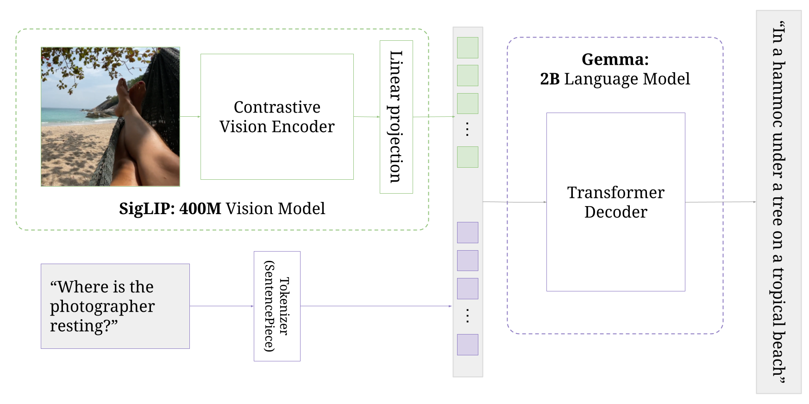
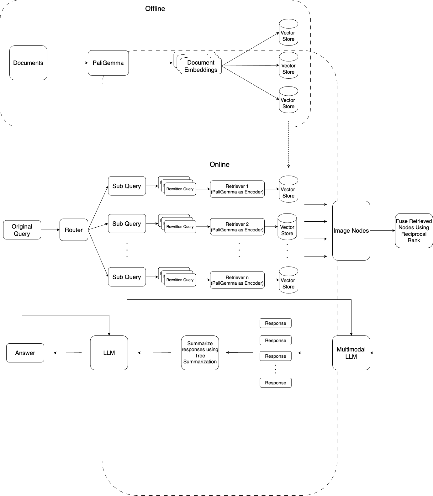

# Image based RAG System using ColPali model
## Overview
Image based RAG system to index and retrieve information from PDF documents without splitting text in the documents into chunks for indexing and querying. The whole image of the documents' pages will be embedded, indexed and queried by using PaliGemma thanks to its ability to extract the correlation between images and texts.

## PaliGemma Architecture


PaliGemma is used as a main embedding model to embed document pages and store them in the Qdrant Vector Store.

Images will be retrieved using Contextualized Late Interaction technique with MaxSim Operator given the query also embedded by PaliGemma.

## Workflow


* Each page in documents is treated as an image, embedded by PaliGemma and store as a multivector in Qdrant Vector store.
* A query given by the users will be decompose to sub questions that can be retrieved from multiple retrievers relevant to the sub questions. 
* For each sub question, it will be rewritten into N (set by the user) queries. These N queries are used to retrieve the most relevant nodes from the assigned retriever.
* Nodes retrieved from the retriever will be fused using reciprocal rank (i.e to handle duplicated nodes, rank nodes follow their original rank and number of apperances)
* Top score nodes (i.e image nodes) are fed into Multimodal LLM with prior rewritten sub questions to get the answers which are then synthesized to get final condensed information.
* This condensed information is finally used as context information to answer the original query.
## Setup & Deployment
**Mandatory:** Create an account and create GEMINI API TOKEN KEY. Export the key as a variable environment. <br></br>
**This project can be run locally following these instruction:**

1. Create virtual environment
```
conda env create --prefix ./.env --file env.yaml
```
2. Activate virtual environment
```
conda activate ./.env
```
3. Start Qdrant container
```
docker-compose up -d
```
4. Start RAG pipeline
```
python3 app.py
```

* Access Gradio App:
    * http://127.0.0.1:7860/

**Or try the demo at: https://huggingface.co/spaces/dnnhhuy/RAG-ColPali**
    
